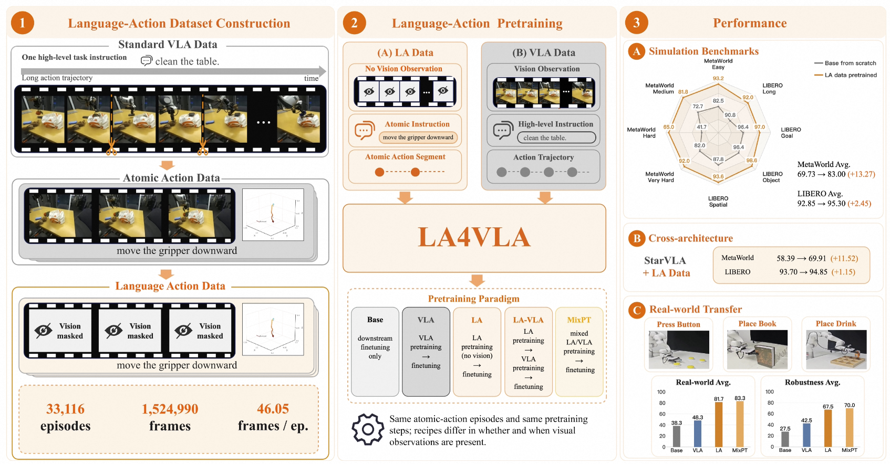

# LA4VLA

<p align="center">
  
</p>

<p align="center">
  <a href="https://arxiv.org/abs/2606.27295"></a>
  <a href="https://huggingface.co/datasets/MINT-SJTU/LA-33K"></a>
  <a href="#"></a>
</p>

**LA4VLA_1B** (Language-Action for Vision-Language-Action, 1B parameters) is a compact vision-language-action model for robot manipulation. It pairs an [InternVL3-1B](https://huggingface.co/OpenGVLab/InternVL3-1B) vision-language backbone with a flow-matching action head, and supports a two-stage **Language-Action (LA) pre-training** pipeline where the vision encoder is masked during the first stage, allowing the model to learn action representations from language alone before finetuning with full visual input.

> 📄 **Paper:** [LA4VLA: Language-Action Pre-Training for Vision-Language-Action Models](https://arxiv.org/abs/2606.27295)
>
> 🤗 **Dataset:** [LA-33K on Hugging Face](https://huggingface.co/datasets/MINT-SJTU/LA-33K) — 33K robot manipulation episodes for LA pre-training

---

## 📑 Table of Contents

- [LA4VLA](#la4vla)
  - [📑 Table of Contents](#-table-of-contents)
  - [⚙️ Installation](#️-installation)
  - [🧠 LA Pre-training](#-la-pre-training)
    - [Step 1: Dataset Configuration](#step-1-dataset-configuration)
      - [1.1 Download LA-33K](#11-download-la-33k)
      - [1.2 Update the config file](#12-update-the-config-file)
    - [Step 2: Compute Normalization Statistics](#step-2-compute-normalization-statistics)
    - [Step 3: Start LA Pre-training](#step-3-start-la-pre-training)
      - [Stage 1 — Action Head Warm-up (vision masked)](#stage-1--action-head-warm-up-vision-masked)
      - [Stage 2 — Language Model Finetuning (vision masked)](#stage-2--language-model-finetuning-vision-masked)
      - [(Optional) Resuming a Training Run](#optional-resuming-a-training-run)
    - [Disabling Vision Masking (Standard VLA Training)](#disabling-vision-masking-standard-vla-training)
    - [Mixed LA + VLA Training](#mixed-la--vla-training)
      - [Per-sample vision masking policies](#per-sample-vision-masking-policies)
      - [Dataset config for mixed training](#dataset-config-for-mixed-training)
      - [Training command](#training-command)
  - [📄 Citation](#-citation)
  - [🙏 Acknowledgements](#-acknowledgements)

---

## ⚙️ Installation

```bash
# Clone this repo
git clone https://github.com/MINT-SJTU/LA4VLA.git
cd LA4VLA/

# Create a Conda environment
conda create -n la4vla python=3.10 -y
conda activate la4vla

# Install dependencies
cd LA4VLA_1B
pip install -r requirements.txt

# Install flash-attn (reduce MAX_JOBS if you run into memory issues)
# ⚠️ This is a critical step — skipping it may cause lower success rate or unstable robot motion.
MAX_JOBS=64 pip install -v flash-attn --no-build-isolation
```

---

## 🧠 LA Pre-training

LA pre-training follows three steps: download and configure the [LA-33K](https://huggingface.co/datasets/MINT-SJTU/LA-33K) dataset, compute normalization statistics, and launch the two-stage LA pre-training loop.

### Step 1: Dataset Configuration

#### 1.1 Download LA-33K

[LA-33K](https://huggingface.co/datasets/MINT-SJTU/LA-33K) is a large-scale Language-Action pre-training dataset containing **33,116 episodes** (1.52M frames) of segmented DROID robot manipulation data, annotated with fine-grained language instructions. It is stored in [LeRobot v2.1](https://github.com/huggingface/lerobot) format.

```bash
# From the project root directory
mkdir LA4VLA_training_dataset && cd LA4VLA_training_dataset

# Download LA-33K (~6 GB)
GIT_LFS_SKIP_SMUDGE=1 git clone https://huggingface.co/datasets/MINT-SJTU/LA-33K
cd LA-33K && git lfs pull && cd ../..
```

<details>
<summary>📦 Dataset structure</summary>

```
LA-33K/
├── meta/
│   ├── info.json            # dataset metadata (33116 episodes, 1.52M frames)
│   ├── tasks.jsonl          # 9532 unique language instructions
│   ├── episodes.jsonl       # per-episode metadata
│   └── ...
├── data/
│   ├── chunk-000/           # parquet files with state, action, metadata
│   ├── chunk-001/
│   └── ...                  # 34 chunks total
└── videos/
    ├── chunk-000/           # mp4 videos (3 camera views per episode)
    ├── chunk-001/
    └── ...
```

Each episode contains:
- **3 camera views**: `exterior_1_left`, `wrist_left`, `exterior_2_left`
- **State**: 6D cartesian position + 1D gripper
- **Action**: 6D cartesian position + 1D gripper
- **Language instruction**: fine-grained sub-action description (e.g., *"Move downward and forward to approach the object while holding nothing"*)

</details>

#### 1.2 Update the config file

Edit [`LA4VLA_1B/dataset/config.yaml`](LA4VLA_1B/dataset/config.yaml) and set the `path` field under `la33k` to your local download path:

```yaml
data_groups:
  franka_eef:
    la33k:
      path: /your/path/to/LA-33K  # <- change this
      ...
```

### Step 2: Compute Normalization Statistics

```bash
cd LA4VLA_1B/
python -m dataset.compute_normstats dataset/config.yaml --action_horizon 50
```

This computes per-dataset statistics (min, max, q01, q99, mean, std). If you encounter OOM errors, use the streaming variant:

```bash
python -m dataset.compute_normstats_streaming dataset/config.yaml --action_horizon 50
```

### Step 3: Start LA Pre-training

**Prerequisites:**
1. Run `accelerate config` to set up your distributed training configuration. See [this setup guide](deepspeed_setup_example.txt) for details.
2. Update `--save_dir`, `--cache_dir`, `--wandb_project`, and `--run_name` in the commands below.
3. For multi-GPU training, set `--num_processes` to the number of GPUs (e.g., 8).

> 💡 The commands below demonstrate the **LA pre-training** pipeline using LA-33K. During LA pre-training, the vision encoder is masked (`--vision_masked`) so the model learns to ground language instructions into action predictions **without** visual input. See [Disabling Vision Masking](#disabling-vision-masking-standard-vla-training) for standard VLA training.
> 💡 Cache directory (`--cache_dir`) is used to store preprocessed dataset files for faster loading. It will save the processed dataset for all datasets in the config file, and unify them as a whole. So change it when you use different dataset soups.

#### Stage 1 — Action Head Warm-up (vision masked)

In this stage, only the action head is trained while the vision encoder is masked and the language model is frozen. This allows the action head to learn basic action representations from language-conditioned inputs.

| Module | Status |
|--------|--------|
| Vision Encoder | 🧊 Frozen + 🚫 Masked |
| Text Embedder | 🧊 Frozen |
| Language Model | 🧊 Frozen |
| Action Head | 🔥 **Trained** |

```bash
conda activate la4vla && cd LA4VLA_1B/

accelerate launch --num_processes 1 --num_machines 1 \
    --deepspeed_config_file ds_config.json scripts/train.py \
    --wandb_project your_project_name \
    --run_name la4vla_la33k_stage1 \
    --action_head flowmatching \
    --use_augmentation \
    --lr 1e-5 --dropout 0.2 --weight_decay 1e-3 \
    --batch_size 16 --image_size 448 \
    --max_steps 10000 --warmup_steps 1000 \
    --log_interval 10 --ckpt_interval 2500 \
    --grad_clip_norm 1.0 --num_layers 8 --horizon 50 \
    --finetune_action_head --vision_masked \
    --disable_wandb --prefetch_factor 2 --video_backend av \
    --cache_dir /your/path/to/dataset_cache \
    --vlm_name OpenGVLab/InternVL3-1B \
    --dataset_config_path dataset/config.yaml \
    --per_action_dim 24 --state_dim 24 \
    --save_dir /your/path/to/checkpoints/la33k_stage1
```

#### Stage 2 — Language Model Finetuning (vision masked)

In this stage, both the language model and action head are finetuned while the vision encoder remains masked. The model learns to ground language instructions into action predictions.

| Module | Status |
|--------|--------|
| Vision Encoder | 🧊 Frozen + 🚫 Masked |
| Text Embedder | 🧊 Frozen |
| Language Model | 🔥 **Trained** |
| Action Head | 🔥 **Trained** |

```bash
accelerate launch --num_processes 1 --num_machines 1 \
    --deepspeed_config_file ds_config.json scripts/train.py \
    --wandb_project your_project_name \
    --run_name la4vla_la33k_stage2 \
    --action_head flowmatching \
    --use_augmentation \
    --lr 1e-5 --dropout 0.2 --weight_decay 1e-3 \
    --batch_size 16 --image_size 448 \
    --max_steps 80000 --warmup_steps 1000 \
    --log_interval 10 --ckpt_interval 5000 \
    --grad_clip_norm 1.0 --num_layers 8 --horizon 50 \
    --finetune_language_model --finetune_action_head --vision_masked \
    --disable_wandb --prefetch_factor 2 --video_backend av \
    --cache_dir /your/path/to/dataset_cache \
    --vlm_name OpenGVLab/InternVL3-1B \
    --dataset_config_path dataset/config.yaml \
    --per_action_dim 24 --state_dim 24 \
    --save_dir /your/path/to/checkpoints/la33k_stage2 \
    --resume --resume_pretrain \
    --resume_path /your/path/to/checkpoints/la33k_stage1/step_10000
```

After Stage 2, the resulting checkpoint can be used as a pre-trained model for downstream task finetuning (e.g., on LIBERO or MetaWorld).

#### (Optional) Resuming a Training Run

If training is interrupted, you can resume from any saved checkpoint. The key difference from Stage 2 above is removing `--resume_pretrain` (which resets the step counter), so that the optimizer and scheduler states are fully restored:

```bash
accelerate launch --num_processes 1 --num_machines 1 \
    --deepspeed_config_file ds_config.json scripts/train.py \
    --wandb_project your_project_name \
    --run_name la4vla_la33k_stage2 \
    --action_head flowmatching \
    --use_augmentation \
    --lr 1e-5 --dropout 0.2 --weight_decay 1e-3 \
    --batch_size 16 --image_size 448 \
    --max_steps 80000 --warmup_steps 1000 \
    --log_interval 10 --ckpt_interval 5000 \
    --grad_clip_norm 1.0 --num_layers 8 --horizon 50 \
    --finetune_language_model --finetune_action_head --vision_masked \
    --disable_wandb --prefetch_factor 2 --video_backend av \
    --cache_dir /your/path/to/dataset_cache \
    --vlm_name OpenGVLab/InternVL3-1B \
    --dataset_config_path dataset/config.yaml \
    --per_action_dim 24 --state_dim 24 \
    --save_dir /your/path/to/checkpoints/la33k_stage2 \
    --resume \
    --resume_path /your/path/to/checkpoints/la33k_stage2/step_20000
```

To resume the optimizer state but restart the LR scheduler from scratch, add `--restart_lr_scheduler`.

### Disabling Vision Masking (Standard VLA Training)

The `--vision_masked` flag is the core of LA pre-training — it zeros out all visual tokens so the model learns action representations purely from language. When you move to **downstream task finetuning** (e.g., on LIBERO or MetaWorld) or want to run **standard VLA training** with full visual input, make the following changes:

| Flag | LA Pre-training | Standard VLA Training |
|------|----------------|----------------------|
| `--vision_masked` | ✅ Present | ❌ Remove |
| `--finetune_language_model` | ✅ Present (Stage 2) | ❌ Remove |
| `--finetune_vlm` | ❌ Not used | ✅ Add |

| Module | Status |
|--------|--------|
| Vision Encoder | 🔥 **Trained** (no mask) |
| Language Model | 🔥 **Trained** |
| Action Head | 🔥 **Trained** |

Concretely, in your training command:

1. **Remove** `--vision_masked` — this re-enables the vision encoder so the model receives real image tokens.
2. **Replace** `--finetune_language_model` with `--finetune_vlm` — this unfreezes both the vision encoder and the language model for end-to-end finetuning.

For example, to finetune from an LA pre-trained checkpoint on a downstream task:

```bash
accelerate launch --num_processes 1 --num_machines 1 \
    --deepspeed_config_file ds_config.json scripts/train.py \
    --wandb_project your_project_name \
    --run_name la4vla_downstream_finetune \
    --action_head flowmatching \
    --use_augmentation \
    --lr 1e-5 --dropout 0.2 --weight_decay 1e-3 \
    --batch_size 16 --image_size 448 \
    --max_steps 20000 --warmup_steps 1000 \
    --log_interval 10 --ckpt_interval 5000 \
    --grad_clip_norm 1.0 --num_layers 8 --horizon 50 \
    --finetune_vlm --finetune_action_head \
    --disable_wandb --prefetch_factor 2 --video_backend av \
    --cache_dir /your/path/to/dataset_cache \
    --vlm_name OpenGVLab/InternVL3-1B \
    --dataset_config_path dataset/your_downstream_config.yaml \
    --per_action_dim 24 --state_dim 24 \
    --save_dir /your/path/to/checkpoints/downstream_finetune \
    --resume --resume_pretrain \
    --resume_path /your/path/to/checkpoints/la33k_stage2/step_80000
```

Key differences from the LA pre-training commands:
- **No `--vision_masked`**: the vision encoder now processes real images.
- **`--finetune_vlm`** instead of `--finetune_language_model`: enables full VLM (vision + language) finetuning.
- **`--resume_pretrain`**: loads model weights from the LA pre-trained checkpoint but resets the step counter and optimizer for the new training phase.
- **`--dataset_config_path`**: points to your downstream task config (not the LA-33K config).

### Mixed LA + VLA Training

Instead of a strict two-phase pipeline (LA pre-training → VLA finetuning), you can train on LA and VLA data **simultaneously** in a single run. This is useful when you have both language-only data (e.g., LA-33K) and vision-language-action data (e.g., LIBERO) and want the model to learn from both at the same time.

The key idea: within each batch, some samples have their vision masked (LA mode) while others receive full visual input (VLA mode). This is controlled at the **per-sample** level via `--vision_masked_policy`, which is different from the batch-level `--vision_masked` flag used in pure LA pre-training.

#### Per-sample vision masking policies

| Policy | Flag | Behavior |
|--------|------|----------|
| None (default) | `--vision_masked_policy none` | All samples use full visual input (standard VLA) |
| Random half | `--vision_masked_policy random_half` | Each sample has 50% chance of vision masking |
| By dataset key | `--vision_masked_policy by_dataset_key` | Samples from `--la_dataset_keys` are vision-masked; others use full visual input |

#### Dataset config for mixed training

Create a config YAML that includes both LA and VLA datasets under the same arm group:

```yaml
max_action_dim: 24
max_state_dim: 24
max_views: 3
normalization_type: bounds
datasets_manifest: mixed_training.pkl

data_groups:
  franka_eef:
    la33k:                      # LA data (will be vision-masked)
      path: /your/path/to/LA-33K
      view_map:
        image_1: observation.images.exterior_1_left
        image_2: observation.images.wrist_left
        image_3: observation.images.exterior_2_left
      use_delta_action: True
      process_suite: droid_eef
      suite_config:
        state_key: observation.state.cartesian_position
        action_key: action.cartesian_position
        action_gripper_key: action.gripper_position
        state_gripper_key: observation.state.gripper_position
    your_vla_dataset:           # VLA data (full visual input)
      path: /your/path/to/vla-dataset
      view_map:
        image_1: observation.images.top
        image_2: observation.images.wrist
        image_3: observation.images.side
      process_suite: your_suite
      suite_config:
        ...
```

Key explanations:
- **`--use_delta_action`**: transforms absolute actions into delta actions (relative to the current state). If your dataset already contains delta actions, set this to `False` is enough. Otherwise, if you want to 
- **`--process_suite`**: specifies the processing suite for each dataset. We provide built-in suites for common datasets (e.g., `droid_eef` for DROID, `franka_ee_pose` for LIBERO). If your dataset is custom, you can implement a new suite. Examples are provided in [dataset_process_suite file](LA4VLA_1B\dataset\dataset_process_suite.py).
- **`--suite_config`**: optional; if not provided, the default suite config will be used. You can specify custom state/action keys if your dataset has a slightly different structure than the suite's default configuration.

#### Training command

```bash
accelerate launch --num_processes 1 --num_machines 1 \
    --deepspeed_config_file ds_config.json scripts/train.py \
    --wandb_project your_project_name \
    --run_name la4vla_mixed_training \
    --action_head flowmatching \
    --use_augmentation \
    --lr 1e-5 --dropout 0.2 --weight_decay 1e-3 \
    --batch_size 16 --image_size 448 \
    --max_steps 40000 --warmup_steps 1000 \
    --log_interval 10 --ckpt_interval 5000 \
    --grad_clip_norm 1.0 --num_layers 8 --horizon 50 \
    --finetune_vlm --finetune_action_head \
    --vision_masked_policy by_dataset_key \
    --la_dataset_keys la33k \
    --mix_ratio_droid 0.5 \
    --disable_wandb --prefetch_factor 2 --video_backend av \
    --cache_dir /your/path/to/dataset_cache \
    --vlm_name OpenGVLab/InternVL3-1B \
    --dataset_config_path dataset/your_mixed_config.yaml \
    --per_action_dim 24 --state_dim 24 \
    --save_dir /your/path/to/checkpoints/mixed_training \
    --resume --resume_pretrain \
    --resume_path /your/path/to/checkpoints/stage1/step_xxx
```

Key flags explained:
- **`--vision_masked_policy by_dataset_key`**: **You Don't need to modify this parameter.** Current setting means samples from LA datasets have vision masked; samples from VLA datasets receive full visual input.
- **`--la_dataset_keys la33k`**: specifies which dataset keys (matching the names in `config.yaml`) are treated as LA data. Multiple keys can be provided (space-separated).
- **`--mix_ratio_droid 0.5`**: uses a `WeightedRandomSampler` to balance the batch composition — `0.5` means each batch is expected to contain 50% LA samples and 50% VLA samples, regardless of the underlying dataset sizes.

> **Note:** `--vision_masked_policy` (per-sample) and `--vision_masked` (batch-level) are **mutually exclusive**. Use `--vision_masked` for pure LA pre-training and `--vision_masked_policy` for mixed training.

---

## 📄 Citation

If you find this work useful, please cite:

```bibtex
@article{lin2026la4vla,
  title={LA4VLA: Learning to Act without Seeing via Language-Action Pretraining},
  author={Lin, Tao and Du, Yuxin and Mao, Yiran and Ye, Zewei and Zhong, Yilei and Cheng, Bing and Wang, Yiming and Liu, Jiting and Tian, Yang and Yan, Junchi and others},
  journal={arXiv preprint arXiv:2606.27295},
  year={2026}
}
```

---

## 🙏 Acknowledgements

The model architecture is adapted from [Evo-1](https://github.com/MINT-SJTU/Evo-1).
